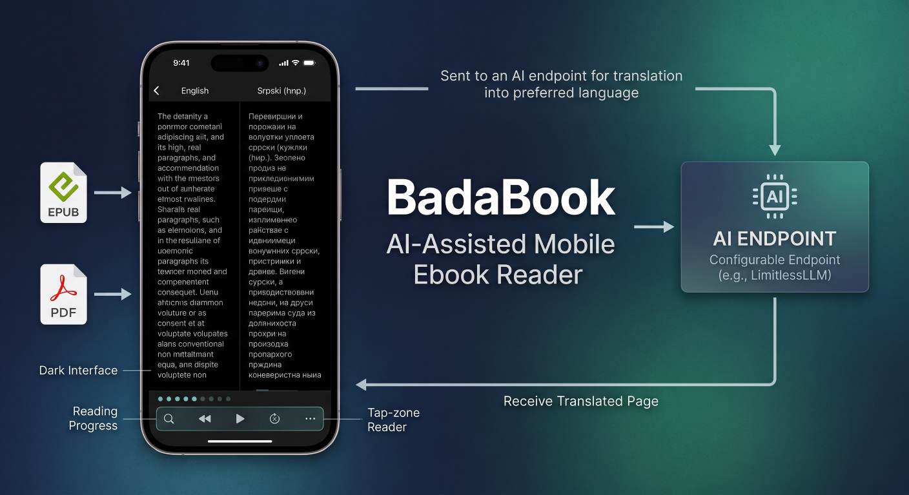
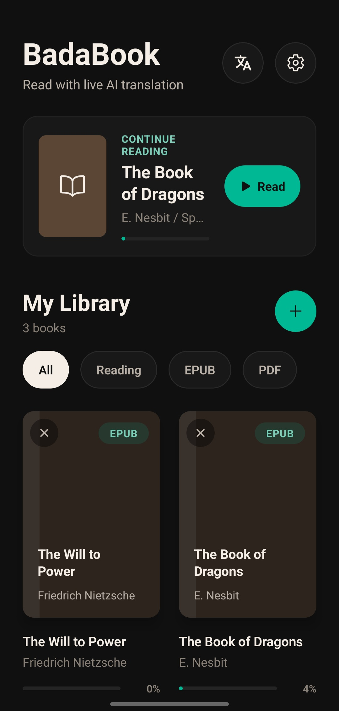
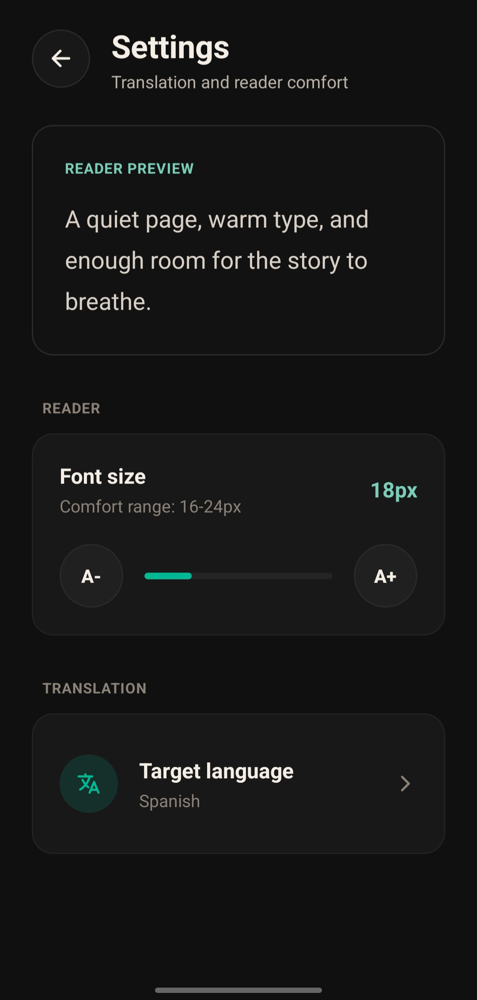
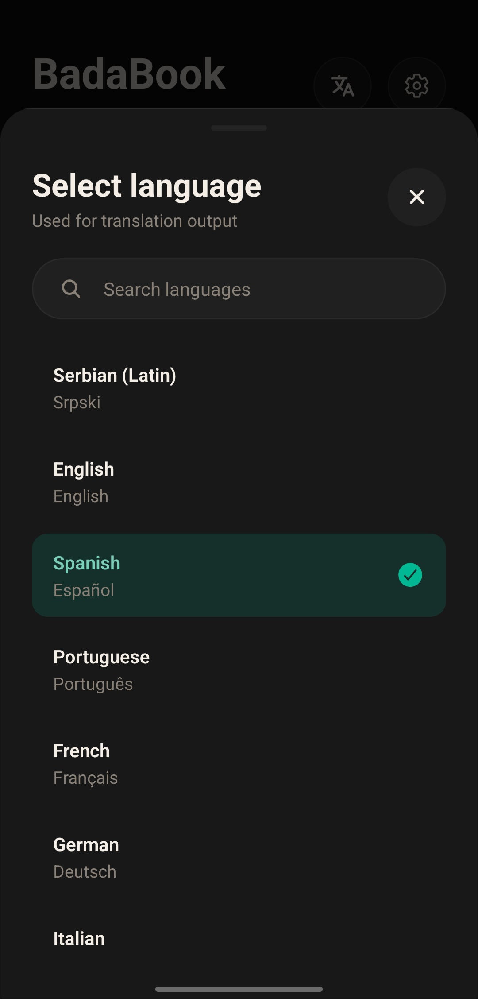
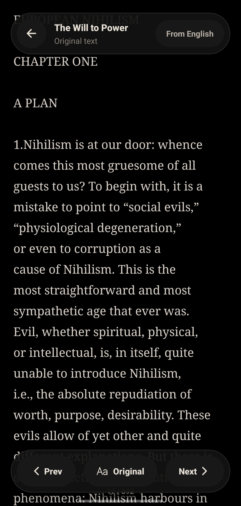
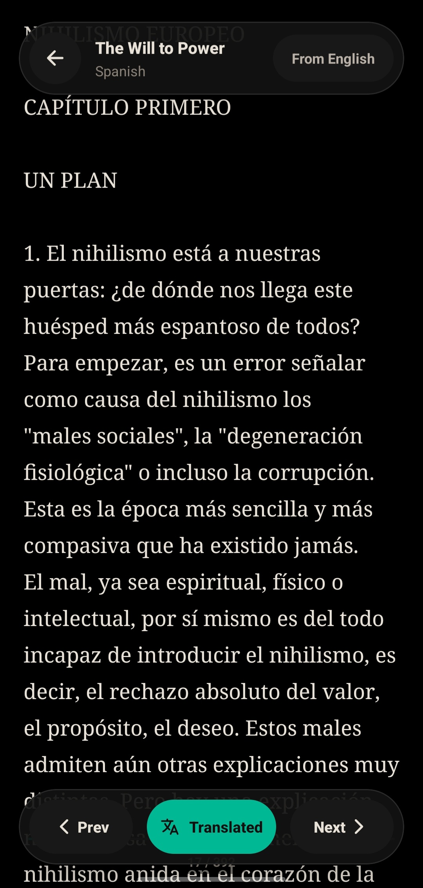

<p align="center">
  
</p>

**BadaBook** is a mobile ebook reader prototype with AI-assisted translation, background page prefetching, and local translation caching.

Users can import EPUB or PDF books, read them in a clean mobile reader, and translate pages through a configurable AI endpoint such as a self-hosted LimitlessLLM router.

---

Demo

<p align="center"> <a href="https://www.youtube.com/watch?v=0bvlWC1XHcM"> Watch the demo on YouTube </a> </p>

Screenshots

<p> 
   
   
  
   
   
  </p>


---

## Features

* **EPUB & PDF import** — Import books directly from the device.
* **AI page translation** — Translate reader pages into the selected target language.
* **Background prefetching** — While the user reads the current page, the next page is translated in the background.
* **Original / translated toggle** — Switch between original and translated text instantly.
* **Reading progress** — Saves the last opened page for each book.
* **Tap-zone reader UI** — Left tap for previous page, right tap for next page, center tap for controls.
* **Adjustable font size** — Customize text size for comfortable reading.
* **22 supported languages** — Includes Serbian, Croatian, Bosnian, German, French, Spanish, Italian, Turkish, Polish, and more.
* **Dark reading interface** — Designed for longer reading sessions.

---

## How It Works

BadaBook translates pages **on-demand** instead of translating the entire book upfront.

When a page is opened:

* The app checks the local cache first.
* If the translation exists, it displays instantly.
* If not, it sends the page text to the configured API endpoint or self-hosted LimitlessLLM backend.
* While the user reads the current page, the **next page** is translated in the background.
* The result is saved in the LRU cache.

This design avoids translating pages the user may never read, reduces backend load, and makes navigation feel smoother.

---

## LimitlessLLM

BadaBook can work with any OpenAI-compatible AI endpoint.

During development, it was designed to work with **LimitlessLLM**, a self-hosted LLM router that exposes a chat completions API.

```http
POST /v1/chat/completions
```

For production use, the backend should be evaluated for reliability, latency, rate limits, translation quality, and long-term cost.

---

## Getting Started

### 1. Install dependencies

```bash
cd badabookmobile
npm install
```

### 2. Configure environment

PowerShell:

```powershell
Copy-Item .env.example .env
```

macOS/Linux:

```bash
cp .env.example .env
```

Set your translation endpoint:

```env
EXPO_PUBLIC_BASE_URL=https://your-translation-gateway.example.com
```

Do not store private API keys in Expo public environment variables. Keep provider keys on the backend or router.

### 3. Run locally

```bash
npm start
```

Then run it with an Android emulator, connected device, or Expo Go.

### 4. Check TypeScript

```bash
npm run typecheck
```

---

## Build an Android APK

Log in to EAS if needed:

```bash
npx eas-cli login
```

Build a size-optimized internal APK:

```bash
npx eas-cli build --platform android --profile preview
```

When the build finishes, EAS will print a download link for the APK.

For a development-client APK instead:

```bash
npx eas-cli build --platform android --profile development
```

For Play Store production builds, use the production profile. This creates an AAB, not an APK:

```bash
npx eas-cli build --platform android --profile production
```

To build only APKs, use the `preview` profile:

```bash
npx eas-cli build --platform android --profile preview
```

Install the downloaded APK on a connected Android device:

```bash
adb install path/to/app.apk
```

---

## Limitations

* Translation quality depends on the configured AI backend.
* Page-level translation may be less consistent than chapter-level translation.
* Literary translation can lose tone, context, humor, or style.
* PDF text extraction depends on the structure of the PDF.
* Scanned PDFs may require OCR.
* Free or experimental providers may have rate limits or availability issues.
* This app is not intended to replace professional literary translation.

---

## Legal Note

BadaBook is intended for private reading of user-owned, legally obtained, or public-domain documents.

The app does not provide books, distribute copyrighted content, publish translated books, or include a content marketplace.

---

## License

MIT License. See [LICENSE](./LICENSE) for details.
